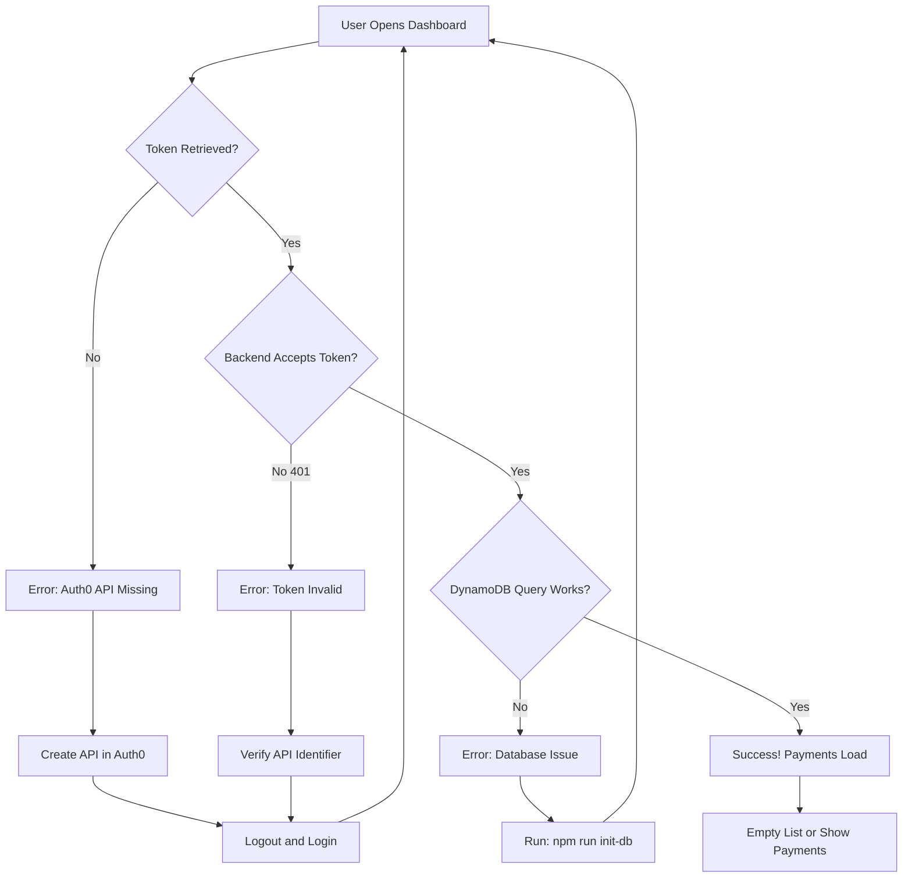

# Fix Summary - "Failed to Fetch Payments" Error

## ✅ All Debugging Code Implemented

All debugging has been successfully added to help diagnose and fix the payment fetch error.

### Files Modified:
- ✅ `client/src/App.tsx` - Token retrieval debugging
- ✅ `client/src/services/api.ts` - API call debugging  
- ✅ `server/src/routes/payments.ts` - Backend debugging
- ✅ Backend server auto-reloaded (no restart needed)

### Documentation Created:
- ✅ `AUTH0_SETUP_GUIDE.md` - Step-by-step Auth0 API setup
- ✅ `DEBUGGING_COMPLETE.md` - Complete testing and troubleshooting guide

## 🎯 Most Likely Fix (90% Probability)

The error is almost certainly caused by a **missing Auth0 API configuration**.

### Quick Fix:

1. **Go to Auth0 Dashboard**: https://manage.auth0.com
2. **Navigate to**: Applications → APIs
3. **Create API**:
   - Name: `Payment Dashboard API`
   - Identifier: `https://payment-dashboard-api`
   - Signing Algorithm: `RS256`
4. **Logout and Login** to the app to get a fresh token
5. **Test again** - it should work!

See `AUTH0_SETUP_GUIDE.md` for detailed instructions with screenshots guide.

## 🔍 How to Diagnose

### Step 1: Open Browser Console
1. Go to http://localhost:5173
2. Press **F12** 
3. Go to **Console** tab
4. Try to load the dashboard

### Step 2: Read the Debug Messages

The console will now show detailed messages like:

**If Auth0 API is missing:**
```
❌ Failed to get access token: consent_required
```
→ **Fix**: Create the Auth0 API (follow AUTH0_SETUP_GUIDE.md)

**If token works but backend rejects it:**
```
✅ Token retrieved successfully
❌ API: Failed to fetch payments
   Status: 401
```
→ **Fix**: Verify API identifier matches, logout/login again

**If DynamoDB has issues:**
```
✅ Token retrieved successfully
✅ API: Fetching payments...
❌ API: Failed to fetch payments
   Status: 500
```
Check backend logs for DynamoDB error
→ **Fix**: Run `npm run init-db`

**If everything works:**
```
✅ Token retrieved successfully
✅ API: Payments fetched successfully
   Count: 0
```
→ **Success!** No payments yet, click "Create Payment" to add one

## 📋 Checklist

Current status of all systems:

- ✅ DynamoDB Local: Running
- ✅ Backend Server: Running with debugging
- ✅ Frontend: Running  
- ✅ Payments Table: Created
- ⚠️ Auth0 API: **Check if exists** (most likely missing)

## 🚀 Next Steps

1. **Open the app**: http://localhost:5173
2. **Open DevTools Console**: F12
3. **Check the debug messages**
4. **Follow the fix** for your specific error
5. **Most likely**: Create Auth0 API (see AUTH0_SETUP_GUIDE.md)

## 📚 Documentation

All guides are ready:

- **`AUTH0_SETUP_GUIDE.md`** - How to create Auth0 API (with checklist)
- **`DEBUGGING_COMPLETE.md`** - Full troubleshooting guide
- **`DATABASE_SETUP_COMPLETE.md`** - DynamoDB setup reference

## 💡 Understanding the Flow



## 🎓 What the Debugging Shows

The new debug logs will tell you exactly:

**Frontend:**
- ✓ Is Auth0 authentication working?
- ✓ Is the token being retrieved?
- ✓ Is the token being sent to the API?
- ✓ What status code is the API returning?
- ✓ What error message is coming back?

**Backend:**
- ✓ Is the request reaching the backend?
- ✓ Is the Authorization header present?
- ✓ Is the JWT being validated?
- ✓ Is the userId being extracted?
- ✓ Is DynamoDB responding?
- ✓ What exactly is the error?

No more guessing - you'll see exactly what's failing!

## ⚡ Quick Command Reference

```powershell
# Check if DynamoDB is running
docker ps --filter "name=payment-dashboard-dynamodb"

# Reinitialize database (if needed)
cd server
npm run init-db

# Check backend health
curl http://localhost:3001/health

# Restart backend (if you changed .env)
# Just save any file in server/src/ (tsx watch auto-reloads)
# Or Ctrl+C and run: npm run dev
```

## 🎉 Expected Result After Fix

Once you create the Auth0 API and login again:

1. Console shows: `✅ Token retrieved successfully`
2. Console shows: `✅ API: Payments fetched successfully`
3. Dashboard loads with empty state (or your payments)
4. You can click "Create Payment" and it works!
5. Data persists in DynamoDB (survives restarts)

---

**Ready to test!** Open http://localhost:5173, check the console, and follow the fix for your specific error. The debug messages will guide you! 🚀
